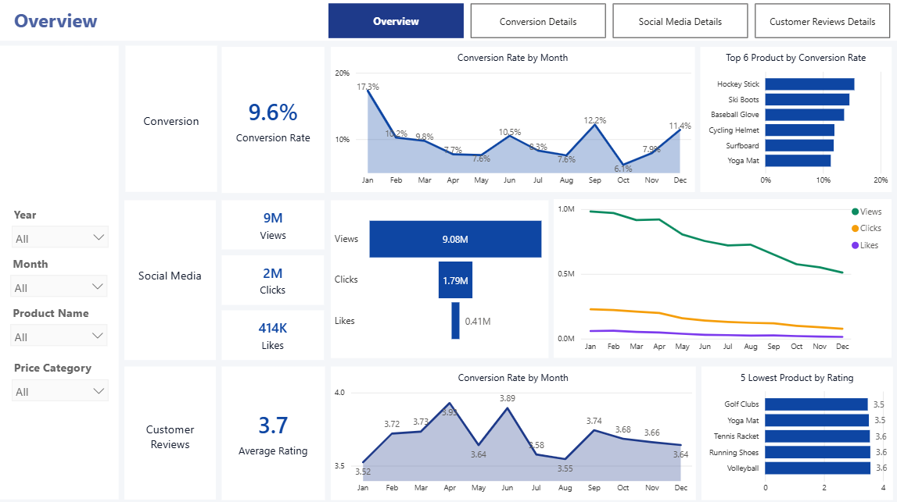
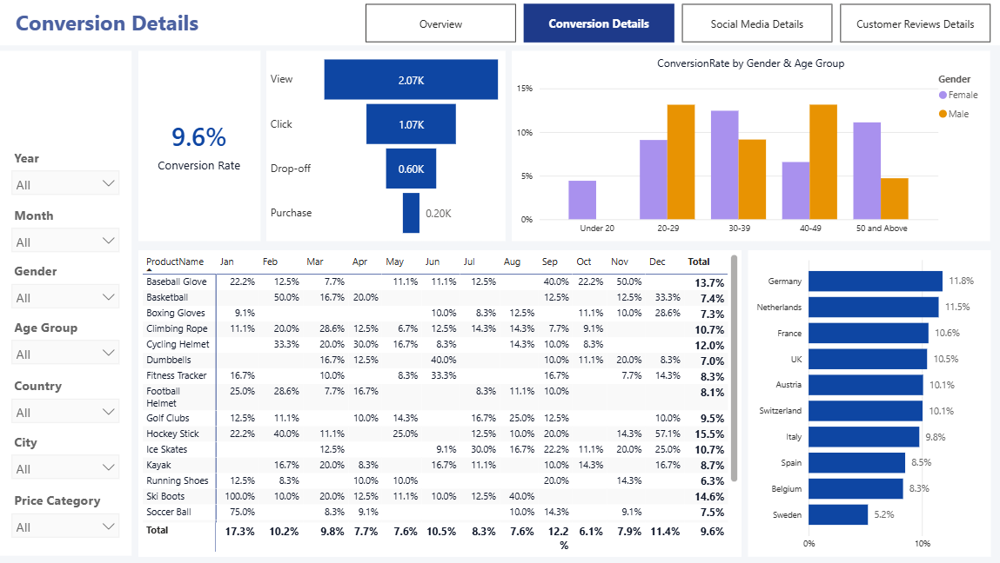
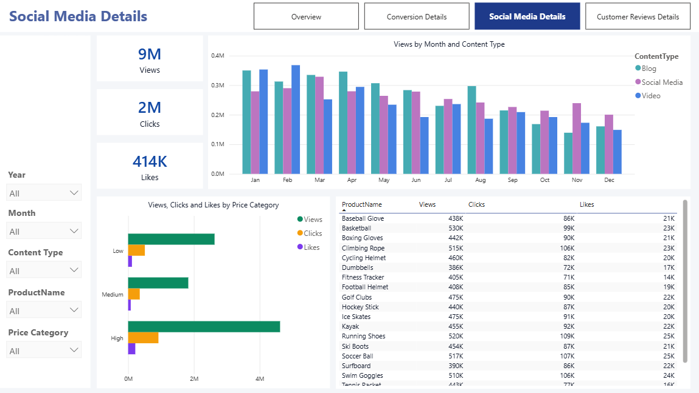
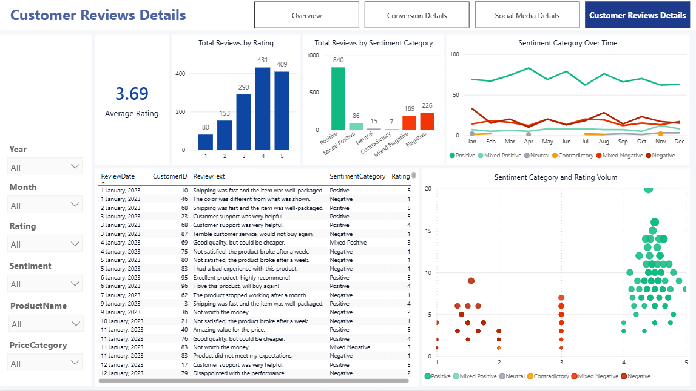

# Marketing Analytics & Customer Sentiment System 🚀

## 📌 Project Overview
This project provides a comprehensive end-to-end analysis of marketing data, covering the entire data pipeline from raw SQL data to actionable insights. It combines data engineering (SQL), natural language processing (Python), and data visualization (Power BI) to help a marketing team improve conversion rates and customer satisfaction.

## 📊 Dashboard Preview

## 📈 Key Insights & Recommendations
*   **Conversion:** January saw the highest conversion (18.5%), driven by "Ski Boots" (150% conversion).
*   **Engagement:** Blog content drives the highest views, but interaction rates are declining towards year-end.
*   **Sentiment:** While average rating is 3.7, NLP analysis identified "Mixed Positive" segments that offer growth opportunities.

## 🛠️ Tech Stack
*   **Database:** MySQL (Data Cleaning & Modeling)
*   **Programming:** Python (NLTK, SQLAlchemy, Pandas)
*   **Visualization:** Power BI
*   **Tools:** Jupyter Notebook, MySQL Workbench

## ⚙️ Data Pipeline

### 1. Data Cleaning & Transformation (SQL)
- Cleaned and standardized raw marketing data using **MySQL**.
- Handled missing values and merged multiple tables (engagement, reviews, and journey).
- Created **SQL Views** to ensure a clean, real-time data source for further analysis.

### 2. Sentiment Analysis (Python - NLP)
- Connected to MySQL using `SQLAlchemy`.
- Leveraged the **NLTK (VADER)** library to perform sentiment analysis on customer reviews.
- Engineered new features:
    - `Sentiment Category`: Based purely on NLP scores.
    - `Sentiment Bucket`: A hybrid classification combining NLP scores with the original customer rating.
- Exported the enriched data back to a new table in MySQL.

### 3. Data Modeling & Visualization (Power BI)
- Built a **Star Schema** data model.
- Created a dynamic `Calendar Table` using DAX for time-intelligence analysis.
- Designed a 4-page interactive dashboard:
    - **Overview:** Main KPIs (Conversion, Social Media, Reviews).
    - **Conversion Details:** Funnel analysis and product performance.
    - **Social Media Details:** Engagement trends and content type analysis.
    - **Customer Reviews:** Deep dive into sentiment distribution and ratings.

## 📁 Repository Structure
* `/data`: Contains the raw dataset.
* `/sql-scripts`: SQL queries used to clean and standardize the data and data exploration and analysis.
* `/python-notebook`: Python code.
* `/powerbi-dashboard`: The main packaged Power BI workbook..
* `/screenshots`: Images of the finished dashboard pages.
